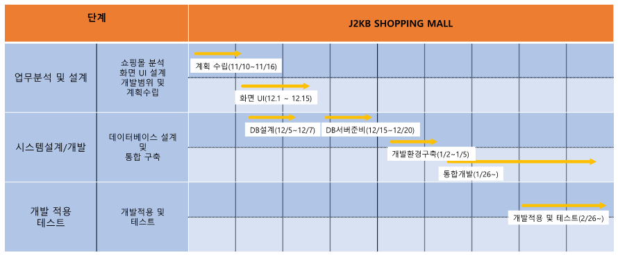
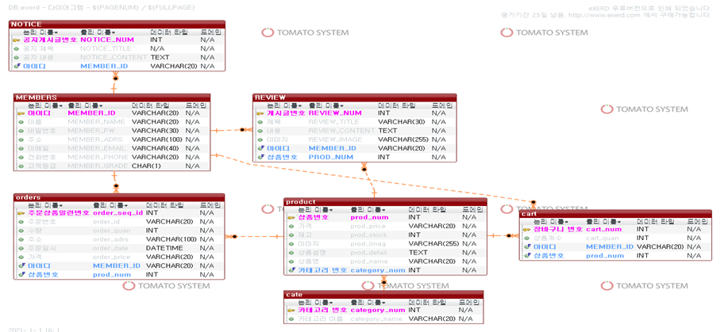
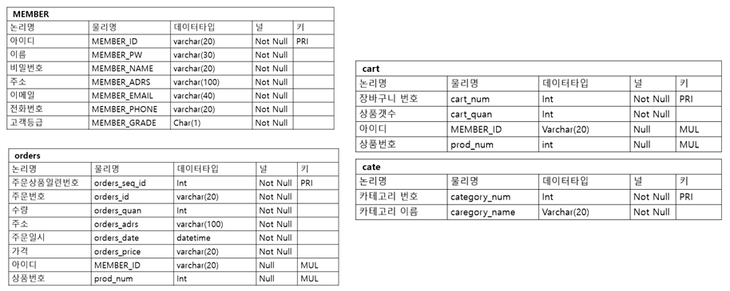
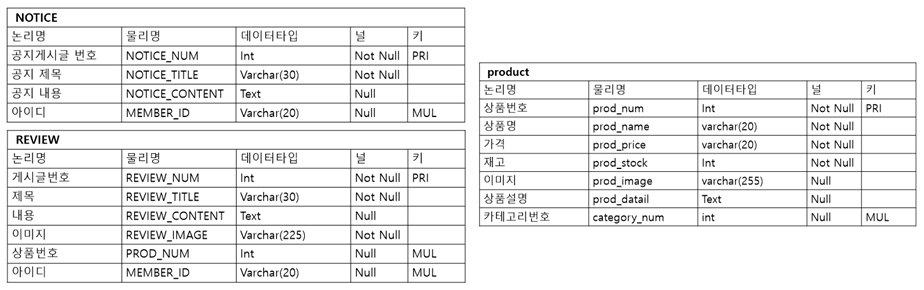
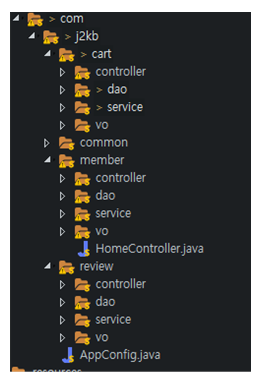
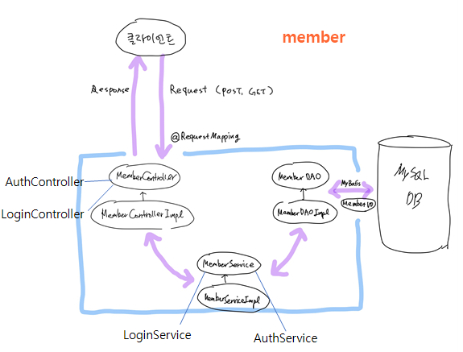
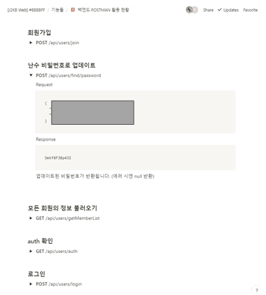
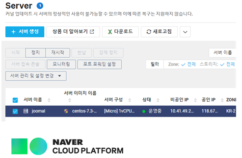

# J2KB-BBBBFF-BE
J2KB 굿즈 쇼핑몰 프로젝트 #BBBBFF 백엔드팀 repositry입니다.

제작 기간 : 2020. 12 ~ 2021. 04

### 팀원

문다예(@dayebyday), 안세아(@takoyummy), 이진희(@Huwon), 조예린(@JooMal, 팀장)

# 과정

### 일정 설계

- 업무분석 및 설계 : 쇼핑몰 분석 화면 UI 설계, 개발범위 및 계획 수립
- 시스템 설계 및 개발 : 데이터베이스 설계 및 통합 구축
- 개발 적용 테스트 : 개발적용 및 테스트

### 사용 스택

#### 협업 툴

- Slack : 깃허브와 연동하여 커밋 및 풀리퀘스트 알람, 프로젝트 관련 파일/이미지 저장
- Notion : 개발 문서, API 문서 공유
- Github : 공용 레파지토리 생성 후 각자 작업하여 커밋 & 풀 리퀘스트 & 머지
- Discord : 회의 및 화면 공유를 통한 코드 설명 & 코드 리뷰
- Trello : Rest API 구현 파트 분배

#### 프론트엔드

- html/css/js
- React
- Node.js
- Redux

#### 백엔드

- 톰캣
- mybatis
- maven
- spring

- mysql

### 데이터베이스

#### ERD

- 이클립스 플러그인 exerd를 사용한 ERD 설계 후 데이터베이스 구축 

#### 테이블

### 백엔드

#### 구조

cart, member, review로 나누어 진행

#### 상세구조 (member)

#### API 문서

#### 배포

네이버 클라우드 플랫폼 1년 무료서버(centos 7.3) 사용하여 배포

